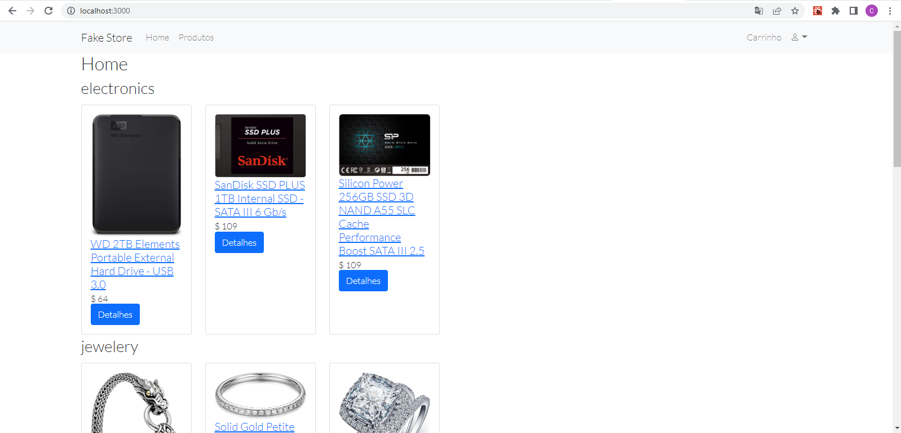

# Fake Store API - REACT

Desafio de integrar uma API "FAKE STORE API" [Link](https://fakestoreapi.com/).


## Índice

- [Visão geral](#visão-geral)
  - [O desafio](#the-challenge)
  - [Captura de tela](#captura-de-tela)
  - [Links](#links)
- [Meu processo](#meu-processo)
  - [Construído com](#construído-com)
  - [O que aprendi](#o-que-aprendi)
  - [Desenvolvimento contínuo](#desenvolvimento-contínuo)
  - [Recursos úteis](#useful-resources)
- [Autor](#autor)


## Visão geral

Integração de produtos, login de adm (com criação de usuario e produtos)

### O desafio

Os usuários devem ser capazes de:

- Visualize o layout da tela com os produtos da FAKE STORE API
- Interagir com a tela com os elementos do CRUD

### Captura de tela


</img>


### Links

- URL da solução: [GITHUB - API FAKE STORE - REACT](https://github.com/AIemao/fakeStoreApiReact)

## Meu processo

 1 - Teamplate das telas
 2 - Organização de pastas
 3 - Criação dos componentes
 4 - Rotas com Outlet
 5 - API

### Construído com

- React jsx
- Propriedades personalizadas de CSS
- API FAKE STORE
- Router Dom
- HOOKS (State, Effect, Context, Params)
- [React](https://reactjs.org/) - biblioteca JS
- [Fake Store Api](https://fakestoreapi.com/) - Estrutura de reação
- [Componentes estilizados](https://styled-components.com/) - Para estilos


### O que eu aprendi

A manipulacao do Context com Effect


```React
export default function CategoriaProdutos({ category }) {
  const [products, setProducts] = useState();
  const { getProductsByCategory } = useContext(Context);

  useEffect(() => {
    getProductsByCategory(category).then((response) => setProducts(response));
  }, [category]);

  return (
    <div>
      <h3>{category}</h3>
      <Row>
        {!products && <p>Carregando ...</p>}
        {products &&
          products.map((product) => (
            <Col md={2} className="my-1 d-flex align-items-flex-start">
              <ProductCard product={product} />
            </Col>
          ))}
      </Row>
    </div>
  );
```

### Desenvolvimento contínuo

Pracitar Outlet, Context e Effect. 
Conexao com DB (SQL SERVER, MONGODB)


### Recursos úteis

- [React documentacao](https://pt-br.reactjs.org/) - Principais conceito os 12 topicos, muito bom. 12. Pensando do jeito React!!
- [React Bootstrap](https://react-bootstrap.github.io/) - Componentes...
- [Router Dom v6](https://reactrouter.com/docs/en/v6/getting-started/overview) - Primeiro contato com o Outlet, quebrando ainda mais o componente!!
- [React Context](https://www.devmedia.com.br/react-js-passando-dados-com-context-api/42904) - Artigo que me deu outra visão do Context

## Autor

- Site - [Celio Junior](https://www.linkedin.com/in/celio-junior-152529193/)

